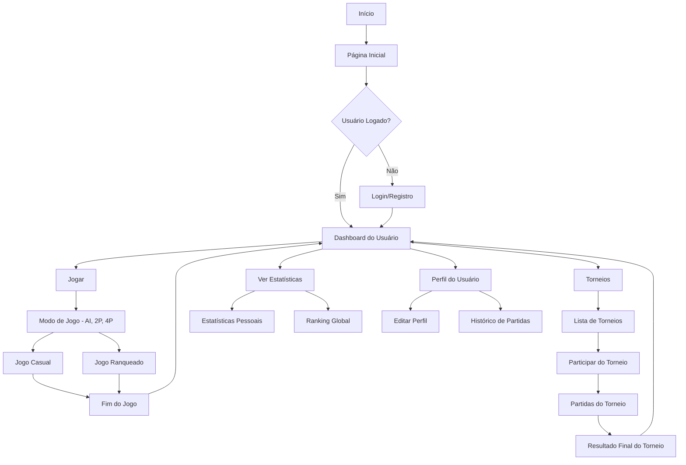

# pong_transcendence
This project is about creating a website for the mighty Pong contest

```mermaid
graph TD
    A[Início] --> B[Página Inicial]
    B --> C{Usuário Logado?}
    C -->|Não| D[Login/Registro]
    C -->|Sim| E[Dashboard do Usuário]
    D --> E
    E --> F[Jogar]
    E --> G[Torneios]
    E --> H[Ver Estatísticas]
    E --> T[Perfil do Usuário]
    F --> I[Modo de Jogo - AI, 2P, 4P]
    I --> J[Jogo Casual]
    I --> K[Jogo Ranqueado]
    G --> L[Lista de Torneios]
    L --> N[Participar do Torneio]
    H --> O[Estatísticas Pessoais]
    H --> P[Ranking Global]
    J --> Q[Fim do Jogo]
    K --> Q
    N --> R[Partidas do Torneio]
    R --> S[Resultado Final do Torneio]
    Q --> E
    S --> E
    T --> X[Editar Perfil]
    T --> Y[Histórico de Partidas]
```
